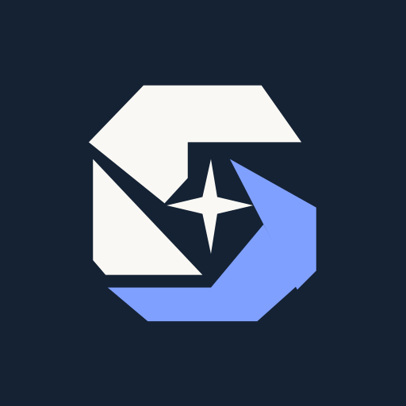

# StarGlass Research

StarGlass connects your AI host to selected official public records. Your host
supplies the reasoning and keeps the conversation. The MCP server provides
read-only source coverage, searches, bounded cited passages and mechanical
checks of supplied evidence. It does not call Parallel or a proprietary LLM.

## Account and connection

Create an account at [aculeus.ai/start](https://aculeus.ai/start), verify your
email, and activate the cardless 30-day trial at
[your StarGlass account](https://aculeus.ai/account/starglass). Installing this
plugin does not create an account or activate a trial. After 30 days, research
pauses unless you explicitly choose the USD 49 monthly subscription. No automatic
trial conversion occurs. The offer includes 1,000 MCP source operations per UTC
calendar month and a separate USD 5 website Quick Answer provider-cost allowance
per trial or paid month; Aculeus absorbs the final admitted Quick Answer's
overrun. Customers have no overage charge. Your AI subscription, hosted Deep
Research and shared workspaces are separate.

This bundle supplies the research skill and a remote MCP connection at
`https://aculeus.ai/api/mcp`. Authenticate through the host's normal OAuth flow
with your StarGlass account. Follow the
[connection guide](https://aculeus.ai/connect) for installation and other hosts.
The server exposes `sources_list`, `source_search`, `source_fetch` and
`evidence_check`. Check the live catalogue for source availability and limits.

## What runs and where data goes

The host sends research tool inputs to the StarGlass MCP server, which retrieves
records from its supported official-source APIs and returns passages, canonical
URLs, retrieval dates, locators and hashes. Account and aggregate quota
bookkeeping remain on Aculeus. The MCP does not store your research files or
final reports. Website Quick Answer is a separate feature, outside these four
MCP tools.

Claude Code also runs the bundled Node.js
[capture hook](scripts/capture.js) after matching StarGlass tool calls. It writes
successful tool-event evidence into the current case directory only when that
directory contains the explicitly authorized `.starglass-capture.json` marker.
With that marker, it saves the allowed session/tool identifiers, tool input and
tool response under `.starglass-evidence/<session-id>/<tool-use-id>.json`; it
omits unrelated transcript paths, server details and headers. Node.js 18 or later
must already be available; the plugin does not install it. The hook makes no
network requests, does not replace tool output and rejects linked or escaping
paths. It is not a sandbox against another process with write access. Read the
[opt-in instructions and limits](skills/starglass-research/references/evidence-bundle.md)
before enabling local capture. Without the marker it does not save evidence.
ChatGPT and Codex use their actual chat/file capabilities; this hook does not
provide equivalent automatic capture in those hosts.

## Coverage and support

Supported source families are USAspending, SEC filings, FEC committee
registrations, identified congressional bills, GovInfo publications, lobbying
disclosures and NPPES organization records. This is not a complete funding
ledger, licensure check, tax/audit extractor or arbitrary-URL crawler. Empty
results do not prove absence. Mechanical evidence checks do not certify truth
or complete coverage. Use the [research workflow](skills/starglass-research/SKILL.md)
to keep gaps and provenance visible.

Publisher: Aculeus, Inc. Support and privacy requests:
[jeremy@aculeus.ai](mailto:jeremy@aculeus.ai).
[Privacy](https://aculeus.ai/privacy) · [Terms](https://aculeus.ai/terms) ·
[MIT license](LICENSE).
